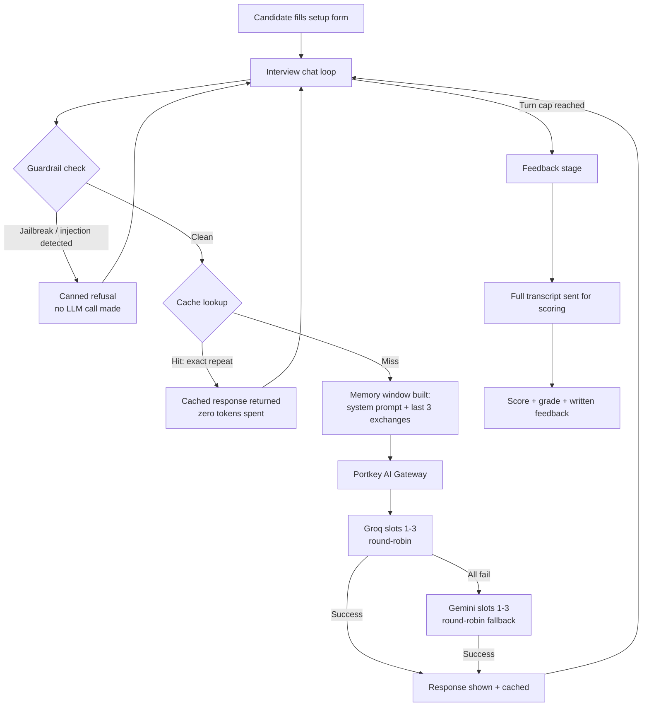

# AI Interviewer

**An interactive mock-interview application powered by Groq and Gemini through the Portkey AI Gateway, with automatic provider fallback, AI security guardrails, response caching, and a built-in evaluation suite.**


A candidate fills in their profile and target role, then has a bounded multi-turn chat with an LLM playing the interviewer, and receives scored, structured feedback at the end — all running on a free/low-cost LLM stack (Groq + Gemini) instead of a paid API, routed through a gateway that adds fallback, load-balancing, and observability for free.

---

## Table of Contents

- [Overview](#overview)
- [Features](#features)
- [Architecture](#architecture)
- [Tech Stack](#tech-stack)
- [Project Structure](#project-structure)
- [Getting Started](#getting-started)
  - [Prerequisites](#prerequisites)
  - [Installation](#installation)
  - [Configuration](#configuration)
  - [Running the App](#running-the-app)
- [How It Works](#how-it-works)
  - [1. Interview Flow](#1-interview-flow)
  - [2. Conversational Memory Layer](#2-conversational-memory-layer)
  - [3. LLM Routing via Portkey](#3-llm-routing-via-portkey)
  - [4. AI Security / Guardrails](#4-ai-security--guardrails)
  - [5. Response Caching](#5-response-caching)
  - [6. Monitoring Dashboard](#6-monitoring-dashboard)
  - [7. Delete Chat / Reset](#7-delete-chat--reset)
- [Evaluation Suite](#evaluation-suite)
- [Configuration Reference](#configuration-reference)
- [Known Limitations](#known-limitations)
- [Roadmap](#roadmap)
- [Additional Documentation](#additional-documentation)
- [Contributing](#contributing)
- [License](#license)

---

## Overview

AI Interviewer simulates a real job interview end-to-end:

1. A candidate enters their profile (name, experience, skills) and the role/company they're targeting.
2. An LLM, primed to act as the hiring interviewer for that exact role, asks questions across a bounded number of turns.
3. At the end, a separate LLM call scores the full transcript and returns a numeric score, letter grade, and written feedback.

It's built as a single-file Streamlit app, but under the hood it includes several production-style concerns that are easy to skip in a demo project: multi-provider LLM fallback, prompt-injection defenses, token-usage caching, bounded conversation memory, and live request monitoring — all visible in the sidebar while you use it.

## Features

**Interview experience**
- Configurable candidate setup (name, experience, skills, seniority level, position, target company)
- Multi-turn interview chat, capped at a configurable number of candidate replies
- Automated end-of-interview scoring (1–10) with letter grade and written feedback
- One-click "Delete Chat" to restart the conversation without re-filling the setup form

**LLM infrastructure**  
- Routed through the [Portkey AI Gateway](https://portkey.ai/) — one OpenAI-compatible integration instead of separate provider SDKs
- Automatic fallback: tries Groq first, falls back to Gemini only if Groq is unavailable
- Round-robin load balancing across multiple virtual keys per provider (avoids single-key rate limits)
- Provider/model overridable via config with no code changes

**AI security**
- Two-layer guardrail system to keep the assistant strictly on-topic (interview prep only)
- Deterministic, pre-LLM jailbreak/prompt-injection filter (zero token cost to block)
- Hardened system prompt as a second line of defense against topic drift

**Efficiency**
- Session-local response cache — a literal repeat of a question costs zero tokens
- Bounded conversational memory window — prompt size stays roughly constant as the interview grows

**Observability**
- Live sidebar metrics: request count, success rate, latency, token usage, provider split, cache hits, blocked requests
- Offline evaluation harness with a scoring rubric, benchmark prompt set, and generated pass-rate reports

## Architecture



Every stage above is reflected in the sidebar in real time — you can watch the Groq/Gemini split, cache-hit count, and blocked-request count change as you use the app.

## Tech Stack

| Layer | Technology | Version used in this project |
|---|---|---|
| Language | Python | 3.10+ (developed/tested on 3.14) |
| UI framework | [Streamlit](https://streamlit.io/) | 1.56.0 |
| LLM gateway | [Portkey AI Gateway](https://portkey.ai/) | REST API, OpenAI-compatible (`/v1` endpoint) |
| LLM SDK | [`openai`](https://pypi.org/project/openai/) Python SDK (used as a generic OpenAI-compatible client, pointed at Portkey) | 2.33.0 |
| Primary LLM provider | Groq — `openai/gpt-oss-20b` | via Portkey virtual keys |
| Fallback LLM provider | Google Gemini — `gemini-3.5-flash` | via Portkey virtual keys |
| Browser bridge | [`streamlit-js-eval`](https://pypi.org/project/streamlit-js-eval/) | 1.0.0 |
| Evaluation harness | Custom Python script (stdlib + `openai`) | — |

## Project Structure

```
Interview chatbot/
├── app.py                          # Entire application: UI, state machine, LLM routing,
│                                    # guardrails, caching, memory layer, monitoring
├── requirements.txt                # Python dependencies
├── .streamlit/
│   └── secrets.toml                # Local secrets (gitignored — never committed)
├── docs/
│   ├── architecture.md             # Deep-dive component & data-flow reference
│   ├── setup.md                    # Setup/configuration instructions
│   └── limitations.md              # Known limitations and honest trade-offs
└── evaluation/
    ├── benchmark_prompts.json      # 20 benchmark prompts across interview categories
    ├── rubric.md                   # Scoring rubric (relevance, correctness, clarity, etc.)
    ├── evaluate.py                 # Runs the benchmark and generates reports
    ├── report.json                 # Latest generated report (machine-readable)
    └── report.md                   # Latest generated report (human-readable)
```

## Getting Started

### Prerequisites

- Python 3.10 or newer
- A [Portkey](https://portkey.ai/) account with **virtual keys** configured for at least one of Groq or Gemini
  - A virtual key is Portkey's way of storing your real provider API key and giving you a safe reference ("slug") to use instead — your actual Groq/Gemini keys never appear in this project's code or config

### Installation

```bash
# Clone the repository
git clone <your-repo-url>
cd "Interview chatbot"

# Create and activate a virtual environment
python -m venv .venv

# Windows
.venv\Scripts\activate

# macOS / Linux
source .venv/bin/activate

# Install dependencies
pip install -r requirements.txt
```

### Configuration

The app authenticates through Portkey rather than calling any LLM provider directly, so no OpenAI/Groq/Gemini key is ever entered into this project. Provide your **Portkey** credentials by either of two methods:

**Option A — Streamlit secrets file** (recommended for local development)

Create `.streamlit/secrets.toml` in the project root:

```toml
PORTKEY_API_KEY = "<your-portkey-api-key>"
PORTKEY_GROQ_SLUGS = ["<groq-virtual-key-1>", "<groq-virtual-key-2>", "<groq-virtual-key-3>"]
PORTKEY_GEMINI_SLUGS = ["<gemini-virtual-key-1>", "<gemini-virtual-key-2>", "<gemini-virtual-key-3>"]
```

You only need slugs for the provider(s) you actually use — an empty list for a provider just skips it. This file is covered by `.gitignore` and must never be committed.

**Option B — Environment variables** (recommended for deployment)

```bash
set PORTKEY_API_KEY=<your-portkey-api-key>
set PORTKEY_GROQ_SLUGS=<groq-virtual-key-1>,<groq-virtual-key-2>,<groq-virtual-key-3>
set PORTKEY_GEMINI_SLUGS=<gemini-virtual-key-1>,<gemini-virtual-key-2>,<gemini-virtual-key-3>
```

Most hosting platforms (Streamlit Community Cloud, Render, Railway, etc.) provide a secrets/environment-variable manager in their dashboard — paste the same values there rather than committing any file.

> See [Configuration Reference](#configuration-reference) below for every supported variable, including optional per-provider model overrides.

### Running the App

```bash
python -m streamlit run app.py
```

The app opens at `http://localhost:8501` by default.

## How It Works

### 1. Interview Flow

The app is a state machine driven by `st.session_state`, moving through four stages:

```
Setup → Interview (bounded turns) → Feedback trigger → Feedback + Score
```

- **Setup** collects the candidate's profile and target role — no LLM call yet.
- **Interview** builds a system prompt from that profile and holds a turn-capped chat (default: 9 candidate replies).
- **Feedback** sends the complete transcript to the LLM with a strict scoring prompt, then extracts a numeric score and maps it to a letter grade.

### 2. Conversational Memory Layer

Only the system prompt plus the **last 3 exchanges** (candidate reply + interviewer question) are sent to the LLM on each turn — not the full growing history. This keeps prompt size, latency, and cost roughly constant as the interview progresses. The complete transcript is still retained separately and used in full for the final feedback/scoring call, so nothing is lost for evaluation purposes — only the live, turn-to-turn "working memory" is bounded.

### 3. LLM Routing via Portkey

Every request goes through the Portkey AI Gateway using the OpenAI SDK pointed at a different base URL, rather than calling any provider's SDK directly:

- Each provider (Groq, Gemini) is represented by up to 3 **virtual-key slugs** in Portkey.
- On each request, every Groq slug is tried **round-robin** first; only if all Groq attempts fail does the app fall back to the Gemini slugs, also round-robin.
- Rotation state persists for the session, so consecutive requests spread evenly across your keys instead of hammering the first one.
- On total failure, the raised error lists **every** attempted provider/slug/model and its specific failure reason — not just the last one — which makes diagnosing a bad model name or an expired key straightforward.

### 4. AI Security / Guardrails

A two-layer defense keeps the assistant confined to interview-prep topics:

- **Layer 1 (deterministic, pre-LLM):** every candidate message is checked against a curated set of jailbreak / prompt-injection patterns (e.g. "ignore previous instructions," "reveal your system prompt," "act as a..."). A match is blocked **before any LLM call is made** — zero token cost, and it can't be argued around by clever phrasing since the model never sees it.
- **Layer 2 (system-prompt level):** for general off-topic requests that don't match a known attack pattern, the interviewer's system prompt itself is hardened to refuse anything unrelated to interview preparation, using a fixed, consistent refusal message.

Both layers return the same canned response, so behavior is predictable regardless of which layer caught the request. This is a defense-in-depth design, not a claim of a perfect filter — see [Known Limitations](#known-limitations).

### 5. Response Caching

Repeating the exact same message (any casing/whitespace) returns the cached answer instantly with **zero tokens spent and no gateway call made**. The cache is keyed on the normalized text of the message itself, so a repeat is recognized as a repeat wherever it happens in the conversation. This is a deliberate trade-off — see [Known Limitations](#known-limitations) for what it means for context-dependent answers.

### 6. Monitoring Dashboard

The sidebar shows live, in-session metrics on every rerun: total requests, success rate, average latency, token usage (prompt/completion/total), the Groq-vs-Gemini request split, blocked-guardrail count, and cache-hit count. It also surfaces the latest offline evaluation suite average and pass rate, if a report has been generated.

### 7. Delete Chat / Reset

A "Delete Chat" control in the top-right clears the current conversation, turn counter, and any feedback — while keeping the candidate's profile intact, so a new interview attempt doesn't require re-filling the setup form.

## Evaluation Suite

A separate, offline benchmark harness measures interview-response quality independent of the live app:

```bash
python evaluation/evaluate.py
```

This runs 20 prompts spanning behavioral, ML-theory, data, coding, production, product, and edge-case categories, scores each response 1–5 across five dimensions (relevance, technical correctness, clarity, actionability, safety/tone), and writes `evaluation/report.json` and `evaluation/report.md`.

**Latest results:**

| Metric | Value |
|---|---|
| Total benchmark cases | 20 |
| Suite average score | 4.56 / 5 |
| Pass rate | 100.0% |
| Pass criteria | Per-answer average ≥ 3.5 |

> Note: the evaluation script currently calls OpenAI directly and is decoupled from the live app's Portkey/Groq/Gemini routing — its scores reflect answer-quality patterns, not the exact production path. See [Known Limitations](#known-limitations).

## Configuration Reference

| Variable | Required | Description | Example (placeholder) |
|---|---|---|---|
| `PORTKEY_API_KEY` | Yes | Your Portkey account API key | `pk_live_xxxxxxxx` |
| `PORTKEY_GROQ_SLUGS` | At least one of this or the Gemini slugs | Comma-separated (env) or TOML array (secrets) of Portkey virtual-key slugs for Groq | `groq-key-1,groq-key-2,groq-key-3` |
| `PORTKEY_GEMINI_SLUGS` | At least one of this or the Groq slugs | Comma-separated (env) or TOML array (secrets) of Portkey virtual-key slugs for Gemini | `gemini-key-1,gemini-key-2,gemini-key-3` |
| `PORTKEY_GROQ_MODEL` | No | Overrides the default Groq model id without a code change | `openai/gpt-oss-20b` |
| `PORTKEY_GEMINI_MODEL` | No | Overrides the default Gemini model id without a code change | `gemini-3.5-flash` |

No real values are shown anywhere in this repository — every example above is a placeholder. Actual credentials live only in `.streamlit/secrets.toml` (gitignored) or your deployment platform's own secrets manager.

## Known Limitations

- **Heuristic evaluation scoring** — the benchmark harness uses lightweight rule-based scoring, not a rigorous LLM-judge rubric.
- **No persistence** — chat history is session-scoped and resets on reload; there is no database.
- **Model output variance** — responses can differ across calls due to LLM nondeterminism, and additionally because a request may be served by either Groq or Gemini depending on fallback activity.
- **In-session-only monitoring** — metrics are not exported to an external observability stack.
- **No authentication or rate limiting** — not hardened for public multi-user deployment as-is.
- **Evaluation suite targets a different backend** — `evaluation/evaluate.py` still calls OpenAI directly, independent of the live app's Portkey/Groq/Gemini path.
- **Guardrails are heuristic, not a hard security boundary** — the deterministic filter matches known attack patterns, not every possible phrasing; general off-topic handling relies on the LLM honoring its system prompt, which is best-effort.
- **Cache is exact-text-match, per-session, and in-memory** — a rephrased repeat still costs tokens, and the cache isn't shared across users or preserved across restarts.
- **Memory window is short and fixed** — only the last 3 exchanges are actively "remembered" turn-to-turn (though the full transcript is still used for final scoring).

Full detail on each of these lives in [`docs/limitations.md`](docs/limitations.md).

## Roadmap

- [ ] Persistent storage for interview history (database-backed)
- [ ] Candidate authentication and per-user session isolation
- [ ] Output-side guardrail filtering, in addition to the current input-side checks
- [ ] Unify the evaluation suite with the live Portkey/Groq/Gemini routing path
- [ ] Export monitoring metrics to an external observability stack

## Additional Documentation

- [`docs/setup.md`](docs/setup.md) — detailed setup and configuration instructions
- [`docs/architecture.md`](docs/architecture.md) — component-by-component architecture and data-flow reference
- [`docs/limitations.md`](docs/limitations.md) — full, unabridged list of known limitations and trade-offs

## Contributing

This is currently a personal/portfolio project. If you'd like to suggest a change:

1. Fork the repository
2. Create a feature branch (`git checkout -b feature/your-idea`)
3. Commit your changes with a clear message
4. Open a pull request describing what changed and why

## License

No license file is currently included in this repository. Until one is added, all rights are reserved by default — please contact the repository owner before reusing this code.
